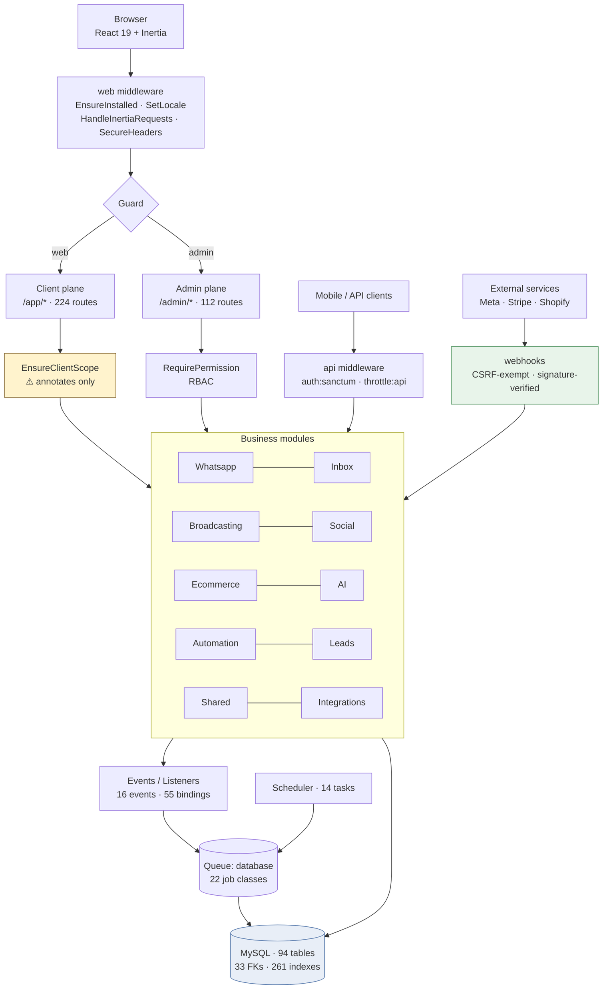
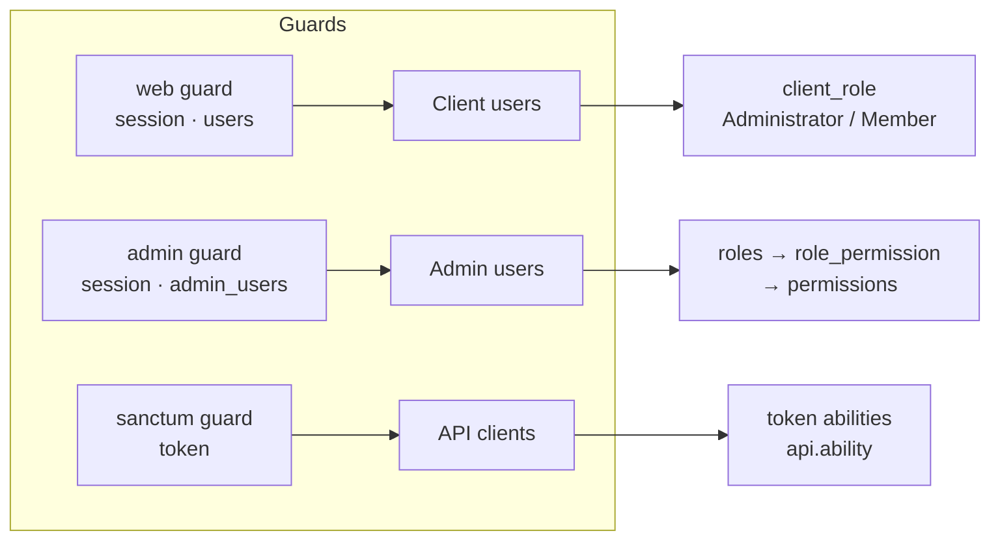

# Complete Project Audit — WhatsMine v1.5.0

**Audit date:** 2026-08-03
**Working directory:** `/Users/honey/Desktop/whatsmine-V1.5.0`
**Auditor role:** Senior Laravel 12 architect / security reviewer
**Method:** Read-only static analysis, dependency advisories, read-only live schema inspection
**Application files modified:** **none** — verified by SHA-256 manifest (§27)

Companion documents: [`project-file-inventory.md`](project-file-inventory.md) · [`project-module-map.md`](project-module-map.md) · [`project-security-findings.md`](project-security-findings.md) · [`project-remediation-roadmap.md`](project-remediation-roadmap.md)

---

## 1. Executive summary

WhatsMine is a substantial, genuinely well-architected multi-channel messaging SaaS: Laravel 12.54.1, React 19 + Inertia 2, 10 business modules, 494 routes, 94 database tables, 14 payment gateways. The engineering standard is visibly high in the places that usually fail — webhook signatures are verified with `hash_equals` in all 14 gateway implementations, third-party credentials are encrypted at rest across 10+ models, every tenant column is indexed, and the one open-redirect candidate is properly signature-protected.

The risk is concentrated elsewhere, in three places.

**First, and most urgent: the test suite will destroy the database.** `phpunit.xml` has its database overrides commented out, so all 81 test files inherit the live connection, and 79 of them use `RefreshDatabase` — which runs `migrate:fresh`. Anyone running `php artisan test` drops all 94 tables. With no Git repository and no verified backup, that loss is likely unrecoverable. **I deliberately did not run the test suite for this reason**, which means the entire test dimension of this audit is unverified.

**Second, dependency exposure is significant** — 3 critical and 13 high npm advisories, plus 5 high Composer advisories including `laravel/framework` and `symfony/http-kernel`, both directly in the request path.

**Third, multi-tenant isolation has no structural enforcement.** `EnsureClientScope` only annotates the request; there are zero Eloquent global scopes. Correctness depends on all ~494 routes remembering to filter by workspace. Every controller I sampled did this correctly — the discipline is real — but nothing prevents the next change from being wrong, and in a multi-tenant SaaS that is the highest-consequence defect class.

Beyond security, the notable structural debt is concentration: `AutomationEngine` is 1,879 lines carrying 127 static-analysis errors (18 % of the project total), and the billing layer duplicates ~6,000 lines across 14 near-parallel gateway classes.

**Verdict: not production-ready as configured**, but the gap is closable. The P0 items are hours of work, not weeks. The architecture is sound; the configuration and the safety net are not.

| Dimension | Rating |
|---|---|
| Architecture & modularity | **Good** |
| Security controls (implemented) | **Good** |
| Security configuration | **Poor** |
| Data integrity | **Fair** |
| Test safety | **Critical failure** |
| Dependency hygiene | **Poor** |
| Documentation | **Poor** |
| Production readiness | **Not ready** |

## 2. Project overview

WhatsMine is a white-label, multi-tenant SaaS for customer messaging and marketing automation. Tenants ("workspaces", owned by "clients") connect WhatsApp Business, Facebook Messenger, and Instagram accounts, run bulk campaigns over WhatsApp/SMS/email, operate a unified agent inbox, build visual automations, sync e-commerce stores, and use AI chatbots with a RAG knowledge base. Billing is subscription-based across 14 gateways with regional coverage (Stripe, PayPal, Paddle, Razorpay, Cashfree, Paymob, Tap, MyFatoorah, Xendit, MercadoPago, Paystack, Square, Mollie).

There is a separate admin plane (`admin` guard, `admin_users` table) for platform operators, distinct from the client plane (`web` guard, `users` table).

The product was previously distributed via CodeCanyon with a Botble license-manager integration; that system was removed in a prior engagement (see `licensing-removal-report.md`).

## 3. Technology stack

| Layer | Technology | Version |
|---|---|---|
| Framework | Laravel | 12.54.1 |
| Language | PHP (runtime) | 8.5.8 |
| Language | PHP (declared requirement) | ^8.2 |
| Frontend | React | 19.2 |
| SPA bridge | Inertia.js | 2.3 |
| Build | Vite | 6.4.1 |
| CSS | Tailwind CSS | 3.x |
| Database | MySQL | 9.3.0 (InnoDB) |
| Realtime | Laravel Reverb / Pusher | 1.10 |
| API auth | Laravel Sanctum | 4.3 |
| 2FA | pragmarx/google2fa | 9.0 |
| Payments | stripe/stripe-php + 13 custom gateways | 19.3 |
| PDF | barryvdh/laravel-dompdf | 3.1 |
| Monitoring | sentry/sentry-laravel | 4.25 (DSN unset) |
| API docs | dedoc/scramble | 0.13 |
| Static analysis | PHPStan + Larastan | level 6 |
| Tests | PHPUnit 11.5 / Vitest 4.1 | |

**Runtime drivers in effect:** cache `database`, session `database`, queue `database`, broadcast `log`, mail `log`, filesystem `local`.

## 4. Repository structure

```
app/
  Console/Commands/    16   Artisan commands (billing, backup, i18n, webhooks)
  Contracts/            1   interfaces
  Events/              16   domain events (many ShouldBroadcast)
  Http/               128   controllers, 16 middleware, requests
  Jobs/                 2   root-level jobs
  Listeners/           15   event listeners
  Mail/                 2
  Models/              36   core Eloquent models
  Modules/            204   10 business modules
  Notifications/       17
  Policies/             4   AdminPolicy, ClientPolicy, WebhookEndpointPolicy, WorkspacePolicy
  Providers/            4
  Services/            35   Billing (14 gateways), Analytics, Storage, Install, I18n
  Support/              3
bootstrap/app.php          routing, middleware aliases, exception handling
config/                21   (config/license.php removed previously)
database/migrations/   49   + 21 inside modules = 70 total
resources/js/              127 pages, 51 components, 7 layouts, 17 locales
routes/                 9   web, api, admin, client, auth, reports, webhooks, channels, console
tests/                 81   test files
docker/                 1   supervisor queue-worker config only
```

## 5. Architecture diagram



## 6. Request lifecycle

1. `public/index.php` → `bootstrap/app.php`
2. **Global `web` stack**, in order: `EnsureInstalled` → `AddLinkHeadersForPreloadedAssets` → `SetLocale` → `HandleInertiaRequests` → `SecureHeaders` → `RequestIdMiddleware` → `BroadcastingAuthDebug`
   - `EnsureInstalled` runs first deliberately, so a fresh deploy redirects to `/install` without touching an empty database — a good ordering decision.
3. **Route-group middleware**
   - Client: `['web','auth','role:client','client.scope','demo']` prefix `/app`
   - Admin: `['web','auth:admin','demo']` prefix `/admin`, with per-route `permission:*`
   - API: `['auth:sanctum','throttle:api','demo']` prefix `/api/v1`
   - Webhooks: `['web','throttle:webhooks']`, CSRF-exempt, signature-verified in controllers
4. **Controller** → module service → Eloquent → MySQL
5. **Response**: Inertia page object, or JSON for API/webhooks
6. `SecureHeaders` applies CSP, X-Frame-Options, nosniff, Referrer-Policy, Permissions-Policy, plus `no-store` for authenticated responses (prevents post-logout bfcache restore — a thoughtful touch)
7. Exceptions → `errors` log channel → optional Sentry

**Middleware aliases:** `demo`, `admin`, `admin.super`, `role`, `permission`, `redirect.if.admin`, `client.scope`, `limit`, `api.ability`.

## 7. Authentication and authorization architecture



| Mechanism | Implementation | Assessment |
|---|---|---|
| Guards | `web` (users), `admin` (admin_users), `sanctum` | Clean separation ✅ |
| Login | Unified `/login`; admin guard attempted first | `admin.login` retained as alias |
| 2FA | `pragmarx/google2fa`; `two_factor_*` columns on `admin_users` | Present, not enforced |
| Magic links | `/magic-link`, throttled 5/min | ✅ |
| Password reset | 60-min expiry, 60-s throttle | Window generous (SEC-019) |
| Email verification | `verified` middleware in `client-app` group | ✅ |
| Admin RBAC | `RequirePermission` + `roles`/`permissions` tables | Granular, applied per-route ✅ |
| Client roles | `client_role` on users | Coarse (2 roles) |
| Gates | Only 2 (`viewAdmin`, `manageAdminSensitive`) | Thin |
| Policies | 4 (Admin, Client, WebhookEndpoint, Workspace) | Sparse for 36 models |
| Tenant isolation | **Manual per-query** | ⚠ **SEC-005** |
| API tokens | Sanctum, **no expiry** | ⚠ **SEC-006** |
| Demo mode | `EnsureNotDemoMode` blocks writes + masks PII | Well-designed ✅ |

**Key weakness.** Authorization is enforced correctly where implemented, but *tenancy* has no structural backstop. See SEC-005.

## 8. Module inventory

Full detail in [`project-module-map.md`](project-module-map.md).

| Module | Files | Purpose | Key risk |
|---|---|---|---|
| Broadcasting | 40 | Campaigns: WhatsApp/SMS/email | Fan-out scaling; 653-line job |
| Ecommerce | 35 | Shopify/Woo/BigCommerce sync | Empty `Policies/`; unbounded backfill |
| AI | 22 | Chatbots, RAG, credit metering | Credit race conditions unverified |
| Whatsapp | 21 | Cloud API, templates | SEC-014 diagnostic hint |
| Social | 20 | Publishing, OAuth refresh | Daily token refresh may lapse |
| Integrations | 17 | `CredentialResolver` | Called from middleware on every request |
| Shared | 17 | Contacts, segments, channels | JSON-path queries unindexable |
| Inbox | 14 | Unified agent inbox | 700-line controller, 2,187-line page |
| Automation | 10 | Visual workflow engine | **1,879-line engine, 127 errors** |
| Leads | 8 | Lead scraping | **SSRF surface — needs manual review** |

## 9. Route inventory

**494 routes total.**

| Prefix | Count | Protection |
|---|---|---|
| `/app/*` | 224 | `auth`, `role:client`, `client.scope`, `demo` — **no throttle** |
| `/admin/*` | 112 | `auth:admin`, `demo`, per-route `permission:*` — **no throttle** |
| `/api/v1/*` | 71 | `auth:sanctum`, `throttle:api`, `demo` ✅ |
| `webhooks/*` | 25 | `throttle:webhooks`, CSRF-exempt, signature-verified ✅ |
| `reports/*` | 5 | `auth`, `role:client`, `client.scope` |
| auth routes | ~15 | throttled 5–10/min ✅ |
| `install/*` | 3 | guest, gated by `EnsureInstalled` |
| `track/*` | 3 | signed URLs ✅ |
| `healthz`, `/up` | 4 | public |

**Observation:** 336 authenticated routes (68 % of the surface) carry no rate limiting (SEC-012).

## 10. Database and model analysis

| Metric | Value |
|---|---|
| Tables | 94 (all InnoDB ✅) |
| Migrations | 70 (49 root + 21 module) |
| Foreign keys | **33** — low for 94 tables ⚠ |
| Unique constraints | 55 |
| Indexes | 261 |
| Tables with `workspace_id` | 29 — **all indexed** ✅ |
| `softDeletes` usage | 1 migration only |
| `$guarded = []` models | **0** ✅ |
| Largest table | `cache` (4.52 MB) — larger than all business tables combined |

**Strengths.** Index coverage is genuinely good. No mass-assignment exposure. All tenant columns indexed. Migrations include hardening work (`harden_subscription_billing_integrity`, `add_unique_webhook_verify_token`).

**Weaknesses.**
- FK coverage ~35 % of tables — referential integrity largely application-enforced (SEC-016).
- Near-absent soft deletes: deletions are permanent, with no recovery path and possible FK orphaning.
- 109 `dropColumn`/`dropIfExists` occurrences across migrations — normal for iterative development, but combined with no soft deletes and no backups this compounds data-loss risk.
- `contacts.custom_fields` queried via `JSON_EXTRACT` (`InboxDuplicateReportCommand:73-78`) — JSON paths cannot use B-tree indexes; will degrade at scale.

**Migration portability.** Heavy use of MySQL-specific JSON functions means the SQLite path suggested in P0-1 may not work for all tests — flagged as a dependency of that fix.

## 11. Queue, event, and scheduler analysis

**Queue.** Driver `database`. 22 job classes (2 root + 20 module).

> **Deployment mismatch:** `docker/supervisor/whatsmine.conf` runs `queue:work redis --queue=default|whatsapp|…`, but `.env` sets `QUEUE_CONNECTION=database`. Deployed workers would poll Redis while the app enqueues to MySQL — **jobs would never execute**. See AUD-PERF-002 / P2-2.

**Events.** 16 event classes, 55 listener bindings. Many implement `ShouldBroadcast` (`MessageReceived`, `ConversationAssigned`, `CampaignCompleted`, `ContactCreated`, `AutomationFailed`) — but `BROADCAST_CONNECTION=log`, so **no realtime delivery currently occurs**. `AutomationTriggerListener` is the hub, handling ≥5 event types.

**Scheduler.** 14 tasks:

| Frequency | Tasks |
|---|---|
| Every minute | `scheduler-heartbeat`, `launch-scheduled-campaigns`, `dispatch-social-posts` |
| Hourly | `billing:sync`, `billing:expire-trials`, `billing:charge-recurring` (+ Paymob, MyFatoorah variants) |
| Daily | `sync-whatsapp-templates` (00:00), `refresh-social-tokens` (02:00), `notifications:trial-ending` (09:00) |
| Weekly | `prune-inbound-webhook-events` (Sun), `reports:weekly-digest` (Mon 09:00) |
| Monthly | `reset-usage-meters` |

Five separate hourly recurring-charge commands is a smell — per-gateway commands rather than one dispatcher.

## 12. External integration inventory

| Integration | Implementation | Signature verified |
|---|---|---|
| WhatsApp Cloud API | `Modules/Whatsapp` | ✅ per-WABA hashed tokens |
| Meta (Messenger/Instagram) | `Modules/Inbox` | ✅ |
| Shopify / WooCommerce / BigCommerce | `Modules/Ecommerce` | ✅ |
| Stripe, PayPal, Paddle, Razorpay, Cashfree, Paymob, Tap, MyFatoorah, Xendit, MercadoPago, Paystack, Square, Mollie | `app/Services/Billing/` (14 classes) | ✅ all use `hash_equals` |
| SMS providers | `Modules/Broadcasting` | ✅ |
| OpenAI (+ Qdrant optional) | `Modules/AI` | n/a |
| Firebase / OneSignal / WebPush | core | n/a |
| Socialite OAuth | core | n/a |
| Sentry | `sentry-laravel` | DSN unset |

**Credential handling** is a genuine strength: `CredentialResolver` centralises access, and configs are `encrypted`-cast in 10+ models.

**Gap:** retry/timeout/backoff policy for outbound HTTP was not systematically verified — flagged for manual review (§28).

## 13. Frontend architecture

| Metric | Value |
|---|---|
| Pages | 127 `.jsx` |
| Components | 51 |
| Layouts | 7 |
| Locales | 17 JSON files |
| Framework | React 19 + Inertia 2 (no Redux/Zustand — Inertia props + local state) |
| Forms | Inertia `useForm` |
| i18n | i18next + react-i18next + http-backend |
| Charts | Recharts; Spreadsheet: Handsontable; Flow: `@xyflow/react` |

**Concerns.**
- **Oversized pages:** `Inbox/Show.jsx` 2,187 lines, `Automation/Builder.jsx` 1,915, `CampaignForm.jsx` 1,756, `Inbox/Setup.jsx` 1,337.
- **Lint:** 194 problems (81 errors, 113 warnings); `no-undef` on `Notification` is a real runtime risk.
- **Bundle:** `BulkImport` chunk is 2.28 MB (592 KB gzipped) due to Handsontable; main bundle 590 KB.
- **CSP:** correctly whitelists the Vite dev server only outside production (`SecureHeaders:66-74`) — well-implemented.
- **Third-party licence key:** Handsontable key read from `VITE_HANDSONTABLE_LICENSE_KEY` — note that `VITE_*` variables are **embedded in the client bundle** and are public by design. Acceptable for Handsontable; ensure no secret ever gets a `VITE_` prefix.

## 14. Security findings

Full detail in [`project-security-findings.md`](project-security-findings.md). 26 findings: **2 Critical, 6 High, 9 Medium, 4 Low, 5 Informational (positive)**.

| ID | Sev | Title |
|---|---|---|
| SEC-001 | Critical | Test suite targets live DB and drops all tables |
| SEC-002 | Critical | 3 critical + 13 high npm; 5 high Composer advisories |
| ~~SEC-003~~ | ~~High~~ | ~~`db:backup` leaks DB password to process list~~ — **FIXED, verified 2026-08-07** |
| SEC-004 | High | SVG upload → stored XSS |
| SEC-005 | High | No model-level tenant scoping |
| SEC-006 | High | Sanctum tokens never expire |
| SEC-007 | High | `.env.example` ships production + debug |
| SEC-008 | High | Framework/http-kernel advisories |
| SEC-009…017 | Medium | Cookies, uploads, CORS, throttling, logging, lockfile, FKs |
| SEC-018…021 | Low | Password policy, reset window, CSP inline, lint |
| SEC-022…026 | Info | **Verified-positive controls** |

## 15. Performance findings

**AUD-PERF-001 · Medium · Campaign fan-out on a database queue.** `LaunchCampaignJob` → `DispatchCampaignChunkJob` → `SendCampaignMessageJob` (653 lines) per recipient, on `QUEUE_CONNECTION=database`. Each job is a MySQL write plus polling. At campaign scale this makes the database the bottleneck. **Fix:** Redis. **Effort:** S (config) / M (validation).

**AUD-PERF-002 · Medium · Queue driver mismatch.** Supervisor runs Redis workers; app enqueues to database. Jobs would never run in production. **Fix:** align. **Effort:** S.

**AUD-PERF-003 · Medium · Unbounded sync jobs.** `BackfillStoreOrdersJob`, `SyncStoreProductsJob`, `SyncStoreCustomersJob` have no visible pagination ceiling. A large store could produce very long-running jobs. **Requires manual verification.** **Effort:** M.

**AUD-PERF-004 · Medium · Cache and sessions on MySQL.** `cache` is already the largest table (4.52 MB vs 0.25 MB for `campaign_recipients`) on a near-empty dataset. Every request performs session reads/writes against MySQL. **Fix:** Redis. **Effort:** S.

**AUD-PERF-005 · Low · N+1 risk.** No systematic eager-loading review was possible without runtime profiling. `AnalyticsService` (889 lines) and `InboxController` (700 lines) are the likely candidates. **Requires manual verification** with Telescope or Clockwork.

**AUD-PERF-006 · Low · JSON-path queries.** `JSON_EXTRACT` on `contacts.custom_fields` cannot use indexes.

## 16. Scalability findings

| Concern | Assessment |
|---|---|
| Horizontal scaling | **Blocked** — `SESSION_DRIVER=database` works multi-node but adds DB load; `FILESYSTEM_DISK=local` breaks multi-node media (S3 supported but unconfigured) |
| Queue scaling | Supervisor config defines per-queue concurrency ✅ but targets the wrong driver |
| Realtime | Reverb bundled; currently `log`. Reverb is single-node without a scaling layer |
| Multi-tenant | 29 tenant tables all indexed ✅; no partitioning strategy for large tenants |
| Media | Local disk default; S3 path exists via `StorageManager` ✅ |
| Database | Single MySQL; no read-replica configuration |
| Rate limiting | Insufficient to protect shared resources under load (SEC-012) |

## 17. Code-quality findings

**AUD-QUAL-001 · Medium · God class.** `AutomationEngine` — 1,879 lines, **127 PHPStan errors (18 % of the project total)**. Executes user-defined workflows touching messaging, AI, and commerce; highest blast radius in the codebase. **Effort:** L.

**AUD-QUAL-002 · Medium · Billing duplication.** 14 gateways, ~6,000 lines of near-parallel structure (Stripe 712, Paymob 567, Tap 544, Mollie 485, Square 483, MercadoPago 478, PayPal 469 …). No shared abstract base. Adding a gateway means copying a template; fixing a signature-verification bug means 14 edits. **Effort:** L.

> ⚠️ **SUPERSEDED 2026-09-07.** Nine gateways (Paddle, Tap, Paystack, Xendit, Paymob,
> MyFatoorah, Mollie, Square, MercadoPago) were removed on `feature/payment-gateway-cleanup`.
> **Four remain: Stripe, PayPal, Razorpay, Cashfree.** The counts and line totals above are the
> measurement as taken on the date of this report and are left unedited as a record; they no
> longer describe the codebase.


**AUD-QUAL-003 · Medium · Fat controllers.** `InboxController` 700, `InboxSetupController` 664, `CampaignController` 601, `MobileConversationController` 501 (69 PHPStan errors).

**AUD-QUAL-004 · Medium · Static-analysis debt.** 722 errors at level 6 with a **310 KB baseline**. Dominated by `property.notFound` (245) and `missingType.iterableValue` (241). The baseline's size means new errors hide easily.

**AUD-QUAL-005 · Low · Thin abstraction layer.** `app/Contracts/` contains **1 interface** for 694 PHP files. Services are concrete and directly instantiated, limiting testability — likely a contributor to the untested state.

**AUD-QUAL-006 · Low · Frontend lint.** 81 errors, 113 warnings.

**Positive:** no `$guarded = []`, no `eval`/`unserialize`, no debug statements left in code, consistent module structure, thoughtful inline documentation (the middleware comments explaining *why* ordering matters are genuinely good).

## 18. Testing assessment

| Metric | Value |
|---|---|
| PHP test files | 81 |
| Using `RefreshDatabase` | 79 |
| Frontend test files | 1 (`components.test.jsx`) |
| Coverage measured | **No** |
| Suite runnable | **No — and dangerous** |

**Critical: the suite cannot be run safely (SEC-001).** It targets the live database and would drop all 94 tables. This is the single most consequential finding in the audit, because it means:
- No regression protection for any change, including the fixes in this roadmap.
- The dependency upgrades in P1-4 cannot be validated.
- Any developer running the standard Laravel test command loses the database.

**Frontend tests are also broken** — `resources/js/__tests__/setup.js` contains JSX but has a `.js` extension, so Vite refuses to transform it and **zero tests execute**. This is independent of SEC-001 and is a pre-existing defect.

**Untested critical areas:** billing gateway signature verification, tenant isolation, `AutomationEngine`, webhook idempotency, queue behaviour, 2FA.

## 19. Deployment assessment

| Aspect | Status |
|---|---|
| `Dockerfile` | **absent** |
| `docker-compose.yml` | **absent** (only `docker-compose.queues.yml`) |
| Supervisor config | present, but targets **Redis** while app uses **database** ⚠ |
| Web server config | **absent** (no nginx/apache vhost) |
| Deployment docs | **absent** |
| Installer | Web wizard at `/install`, 5 steps, requirement checks ✅ |
| `storage:link` | Verified working ✅ |
| Cron | One entry needed: `schedule:run` every minute |
| PHP extensions | Installer checks 10: pdo, pdo_mysql, mbstring, openssl, tokenizer, ctype, json, bcmath, fileinfo, curl ✅ |
| Zero-downtime | **Not ready** — no release/symlink strategy |
| Backup/restore | ✅ **All three claims are stale.** SEC-003 **fixed** (verified 2026-08-07: the password travels in a 0600 `--defaults-extra-file` deleted in a `finally`, and the command uses an argument-array `Process`, so nothing reaches the process list or the environment). `db:restore` **exists** (`DbRestoreCommand.php`) with guards for production, non-`_test` targets, typed-name confirmation, archive corruption, missing `CREATE TABLE`, and a source/target database mismatch. Scheduling **exists** since `041779a` (`dailyAt('01:30')`) — ⚠️ but only fires where the host's cron invokes `schedule:run`, a deploy-day action. Retention still missing. |
| Shared hosting | Plausible (installer + database queue), but no `exec` guarantee for `db:backup` |

**Deployment is the weakest documented area.** A new operator has the installer and `.env.example` — nothing else.

## 20. Dependency assessment

**Composer** — 20 production, 9 dev. 38 advisories across 15 packages (5 high, 25 medium, 6 low). `nunomaduro/larastan` abandoned. **`composer.lock` out of sync with `composer.json`** — reproducible builds not guaranteed.

**npm** — 24 vulnerabilities: **3 critical, 13 high**, 7 moderate, 1 low. Criticals via `concurrently`→`shell-quote` (dev-only). Runtime highs: `axios`, `form-data`, `@grpc/grpc-js` (via firebase), `lodash-es`.

**Heavyweight coupling:** `handsontable` (2.28 MB chunk), `firebase` (153 KB), `exceljs`, `@xyflow/react`. Handsontable additionally requires a commercial licence key for non-evaluation use — a licensing consideration beyond security.

## 21. Dead code and technical debt

| Item | Evidence |
|---|---|
| Empty `Policies/` in Ecommerce | Directory exists, no files — intended authorization never implemented |
| `app/Contracts/` with 1 interface | Abstraction layer started, abandoned |
| 310 KB PHPStan baseline | 722 suppressed errors |
| Broken frontend test setup | `setup.js` contains JSX; 0 tests run |
| Unused broadcast infrastructure | 5+ `ShouldBroadcast` events with `BROADCAST_CONNECTION=log` |
| Reverb configured, unused | Full config block, `REVERB_*` unset |
| Sentry integrated, inactive | DSN unset |
| Qdrant integration | Config present, URL/key unset — RAG likely inert |
| 5 near-identical billing cron commands | Per-gateway rather than dispatched |
| `whatsmine_pipeline_phase7_test`, `testDB` | Stray databases on the host (not repo debt, but operational clutter) |

## 22. High-risk files

| Rank | File | Lines | PHPStan | Why |
|---|---|---|---|---|
| 1 | `app/Modules/Automation/Services/AutomationEngine.php` | 1,879 | 127 | Executes user-defined workflows across all modules |
| 2 | `phpunit.xml` | 47 | — | **Destroys the database when tests run** |
| 3 | `app/Console/Commands/DbBackupCommand.php` | 63 | — | Credential leak + shell interpolation |
| 4 | `app/Http/Controllers/Admin/SystemSettingsController.php` | ~200 | — | SVG upload → stored XSS |
| 5 | `app/Http/Middleware/EnsureClientScope.php` | 25 | — | Tenant boundary that enforces nothing |
| 6 | `app/Services/Billing/StripeGateway.php` | 712 | — | Payment path |
| 7 | `app/Services/AnalyticsService.php` | 889 | 39 | Query-heavy, N+1 candidate |
| 8 | `app/Modules/Inbox/Http/Controllers/InboxController.php` | 700 | — | Largest controller |
| 9 | `app/Http/Controllers/Api/V1/MobileConversationController.php` | 501 | 69 | Highest error density per line |
| 10 | `resources/js/Pages/Inbox/Show.jsx` | 2,187 | — | Largest frontend file |

## 23. Missing documentation

No `README.md`, `CONTRIBUTING.md`, `CHANGELOG.md`, `LICENSE`, architecture docs, deployment guide, API docs (Scramble installed but no published output), runbook, or ADRs. `.env.example` is well-commented and is currently the project's only substantive documentation.

## 24. Recommended improvements

**Immediate:** fix test DB isolation; initialise Git; back up the database; fix `db:backup`.
**Security:** production-safe `.env.example`; Sanctum expiry; remove SVG; patch dependencies; CORS; cookie hardening; tenant global scopes.
**Architecture:** decompose `AutomationEngine`; abstract billing gateways; grow `Contracts/`; extract inbox sub-components.
**Operations:** align queue drivers; move cache/session to Redis; add `Dockerfile`; document deployment; add restore tooling.
**Quality:** burn down the PHPStan baseline per module; fix ESLint errors; repair and grow the test suite.

## 25. Prioritized remediation roadmap

Full detail in [`project-remediation-roadmap.md`](project-remediation-roadmap.md).

- **P0 (3 items):** test-DB guard · Git + backup · `db:backup` fix
- **P1 (9 items):** env defaults · Sanctum expiry · SVG · dependencies · lockfile · CORS · cookies · webhook hint · **tenant scoping**
- **P2 (8 items):** rate limiting · queue driver · Redis · `AutomationEngine` · billing base · ESLint · foreign keys · larastan
- **P3 (6 items):** documentation · PHPStan baseline · frontend splitting · CSP nonces · test suite · containerisation

## 26. Commands executed and results

| # | Command | Result |
|---|---|---|
| 1 | `pwd` | ✅ `/Users/honey/Desktop/whatsmine-V1.5.0` |
| 2 | `git status` | ⚠ Failed — *not a git repository*. Expected; baseline used instead |
| 3 | `find` + `shasum -a 256` (baseline) | ✅ 994 files, digest `53fbe165…` |
| 4 | `php artisan --version` / `about` | ✅ Laravel 12.54.1, PHP 8.5.8 |
| 5 | `php artisan route:list` | ✅ 494 routes |
| 6 | `php artisan event:list` | ✅ 16 events, 55 bindings |
| 7 | `php artisan schedule:list` | ✅ 14 tasks |
| 8 | `php artisan optimize:clear` | ✅ all caches cleared |
| 9 | `php artisan tinker --execute` (config reads) | ✅ session/sanctum/auth/app inspected, **no secrets printed** |
| 10 | `composer validate` | ⚠ **lock file out of date** |
| 11 | `composer audit` | ⚠ **38 advisories**, 1 abandoned package |
| 12 | `npm audit` | ⚠ **24 vulnerabilities** (3 critical, 13 high) |
| 13 | `phpstan analyse` (level 6) | ⚠ **722 errors** |
| 14 | `eslint resources/js` (no `--fix`) | ⚠ **194 problems** (81 errors) |
| 15 | Read-only `information_schema` queries | ✅ 94 tables, 33 FKs, 261 indexes |
| 16 | Source greps (injection, XSS, SSRF, upload, secrets, CSRF, IDOR) | ✅ completed |
| 17 | Re-run `shasum` baseline | ✅ **identical — no files modified** |

**Failed or corrected commands, disclosed in full:**

| Command | Error | Cause | Resolution |
|---|---|---|---|
| `git status` | not a git repository | **Environment** — expected, stated by user | SHA-256 baseline substituted |
| `grep -rn --include='*.php' -E '->store\(...'` | `ugrep: invalid option` | **Environment** — system `grep` is `ugrep`; pattern began with `-` | Re-run with `-e` |
| `php -r '$c=require "config/session.php"'` | `Call to undefined function env()` | **Environment** — config files need the framework bootstrapped | Re-run via `artisan tinker` |
| First shell-exec scan | 15 false positives | **My error** — `system(` matched `CredentialResolver::system()` | Re-run with a stricter pattern; disclosed |
| First migration feature count | returned all zeros | **My error** — shell variable expansion failed | Re-run correctly; cross-checked against live schema |
| `eslint -f compact` | formatter not in core ESLint 9 | **Environment** | Re-run with default formatter |

## 27. Verification failures and what could not be verified

**Deliberately not run (would have been destructive):**

| Command | Reason |
|---|---|
| `php artisan test` | **Would drop all 94 tables** (SEC-001). The entire test dimension is therefore unverified. |
| `npm run build` | Generates files into `public/build/`, violating the no-modification rule. Not run; disclosed. |
| `composer update` / `npm audit fix` | Explicitly forbidden; would alter lockfiles |
| `php artisan migrate*`, `db:wipe` | Explicitly forbidden |

**Could not be verified (require runtime or manual review):**

1. **Test suite health and coverage** — blocked by SEC-001.
2. **Frontend build** — not run by rule; note `node_modules` symlinks are flattened (`.bin/vite` is a 19-byte text file), so `npm run build` would fail in this working copy regardless.
3. **Frontend tests** — `resources/js/__tests__/setup.js` contains JSX with a `.js` extension; 0 tests execute.
4. **N+1 queries** — needs runtime profiling.
5. **Actual IDOR exploitation** — sampled controllers were correct; the remaining ~490 routes were not individually traced (SEC-005).
6. **SSRF in the Leads module** — automated scan found nothing, but the pattern was narrow; scraping code needs focused manual review.
7. **AI credit-metering race conditions** — needs concurrency testing.
8. **HTTP retry/timeout/backoff** across integrations — not systematically traced.
9. **Ecommerce store authorization** — empty `Policies/` directory; enforcement location unconfirmed.
10. **Realtime behaviour** — `BROADCAST_CONNECTION=log`, so broadcast paths are inert and untestable as configured.
11. **Webhook idempotency** — a `WebhookIdempotencyService` exists; correctness not verified.
12. **Production config** — only the local `.env` was inspected (values never printed).

## 28. Manual testing checklist

- [ ] **Before anything:** confirm P0-1 is fixed, then run `php artisan test` and record pass/fail
- [ ] Cross-tenant IDOR: authenticate as workspace A, request every workspace-B resource ID across all 224 `/app/*` routes
- [ ] Admin/client boundary: confirm a client user cannot reach any `/admin/*` route
- [ ] RBAC: for each `permission:*` route, verify a user lacking it receives 403
- [ ] Upload an SVG containing `<script>` as logo; open it directly; confirm whether script executes (SEC-004)
- [ ] Sanctum token: confirm whether an old token still authenticates (SEC-006)
- [ ] Webhook replay: resend a captured Stripe/Meta webhook; confirm idempotency
- [ ] Webhook forgery: send a wrong-signature payload to all 25 webhook routes; expect rejection
- [ ] Campaign at volume (10k+ recipients): observe queue depth and DB load
- [ ] Ecommerce backfill against a large store: check for timeout
- [ ] Leads scraper: attempt internal URLs (`169.254.169.254`, `localhost`) — SSRF
- [ ] 2FA enrol/verify/recovery-code flow
- [ ] Password reset: token reuse and expiry
- [ ] Demo mode: confirm writes blocked and PII masked
- [ ] Installer on a clean database
- [ ] `db:backup` after P0-3: confirm no credential in `ps aux`
- [ ] Restore from backup into a scratch schema

## 29. Production-readiness checklist

| Item | Status |
|---|---|
| `APP_DEBUG=false` in production | ❌ example ships `true` |
| `APP_ENV=production` | ⚠ example pairs it with debug |
| HTTPS + secure cookies | ❌ `SESSION_SECURE_COOKIE` unset |
| Version control | ❌ no Git |
| Database backups | ❌ none scheduled; tool insecure |
| Test suite passing | ❌ unrunnable/destructive |
| Dependencies patched | ❌ 3 critical + 18 high |
| Tenant isolation enforced structurally | ❌ manual only |
| API token expiry | ❌ never expires |
| Rate limiting on authenticated routes | ❌ 336 unthrottled |
| CORS policy | ❌ unconfigured |
| Queue driver aligned with workers | ❌ database vs redis |
| Cache/session off primary DB | ❌ both on MySQL |
| Error monitoring | ⚠ Sentry present, DSN unset |
| Web server config | ❌ absent |
| Deployment documentation | ❌ absent |
| Zero-downtime deploys | ❌ no strategy |
| Webhook signature verification | ✅ |
| Credentials encrypted at rest | ✅ |
| Tenant columns indexed | ✅ |
| Security headers / CSP | ✅ (with `unsafe-inline` caveat) |
| Installer | ✅ |
| RBAC | ✅ |
| Demo mode | ✅ |

**23 items assessed: 7 pass, 3 partial, 13 fail.**

## 30. Final audit conclusion

WhatsMine is a capable, thoughtfully modularised product. The security controls that were actually implemented are implemented *well* — signature verification is consistent and timing-safe across all 14 payment gateways, credentials are encrypted at rest, the click tracker is properly signed, tenant columns are fully indexed, and there is no mass-assignment or dynamic-execution exposure anywhere in 694 PHP files. That is a better baseline than most codebases of this size.

The failures are not in the code that was written; they are in the **safety net around it**. There is no version control, no backup, no runnable test suite — and the test suite that exists will delete the database if anyone runs it. Those four facts compound: every remediation in this report is currently unverifiable and irreversible. That is why P0-1 and P0-2 must precede all other work, including the security fixes.

The one architectural weakness worth treating as a product risk rather than a bug is tenant isolation (SEC-005). Every controller I sampled scoped correctly, so this is not a live breach — it is a structural absence of enforcement. In a multi-tenant SaaS, relying on ~494 routes' worth of developer discipline without a global scope is a matter of when, not whether.

**Current state: not production-ready.** **Reachable state: production-ready within roughly one to two focused weeks**, since the P0 and most P1 items are small. The architecture does not need rework — the configuration, the dependency baseline, and the verification infrastructure do.

**Audit integrity:** 994 files hashed before and after; digests identical; no application file was created, modified, renamed, or deleted. Five documents were added under `docs/`. No secret, credential, token, or environment value appears anywhere in this report or its companions.
