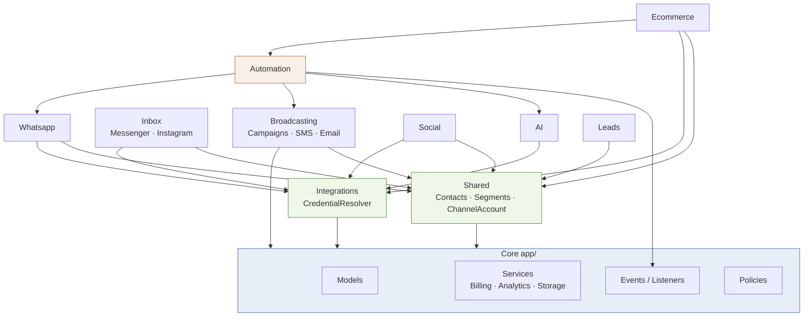

# Module Map — WhatsMine v1.5.0

A modular monolith: 10 business modules under `app/Modules/` (204 PHP files) plus a core `app/` layer. Each module owns its own `Http/`, `Services/`, `Models/`, `Jobs/`, `routes/`, and `database/migrations/`.

## Composition

| Module | Files | Controllers | Services | Models | Jobs | Migrations |
|---|---|---|---|---|---|---|
| Broadcasting | 40 | 6 | 19 | 5 | 5 | 3 |
| Ecommerce | 35 | 6 | 13 | 4 | 6 | 4 |
| AI | 22 | 3 | 9 | 6 | 1 | 1 |
| Whatsapp | 21 | 6 | 2 | 5 | 2 | 4 |
| Social | 20 | 2 | 9 | 3 | 3 | 1 |
| Integrations | 17 | 1 | 9 | 2 | 0 | 2 |
| Shared | 17 | 2 | 3 | 6 | 0 | 3 |
| Inbox | 14 | 6 | 2 | 2 | 1 | 1 |
| Automation | 10 | 1 | 2 | 3 | 1 | 1 |
| Leads | 8 | 1 | 1 | 2 | 1 | 1 |

## Dependency direction

`Shared` and `Integrations` act as the common substrate; `Automation` is the highest-coupling consumer, reaching into AI, Broadcasting, and Whatsapp. No circular module dependency was detected at the directory level.

---

## Broadcasting

**Purpose.** Bulk outbound campaigns across WhatsApp, SMS, and email, with scheduling, chunked dispatch, and per-recipient tracking.

- **Controllers (6):** `CampaignController` (601 lines), `SmsStatusWebhookController`, `EmailTrackingController`, SMS provider config controllers
- **Services (19):** largest service layer in the codebase — per-provider SMS/email drivers
- **Jobs (5):** `LaunchScheduledCampaignsJob`, `LaunchCampaignJob`, `DispatchCampaignChunkJob`, `SendCampaignMessageJob` (653 lines), `FinalizeCampaignJob`
- **Routes:** `/app/broadcasting/*`; webhooks `webhooks/sms/{provider}`, `track/email/{token}/*`
- **Tables:** `campaigns`, `campaign_recipients` (largest non-cache table), `sms_provider_configs`, `workspace_smtp_configs`
- **Scheduler:** `launch-scheduled-campaigns` every minute
- **Events:** `CampaignCompleted` → notification + outbound webhook + automation trigger

**Risks.** `SendCampaignMessageJob` at 653 lines mixes provider selection, rendering, sending, and status recording. Campaign fan-out is the primary scaling pressure (AUD-PERF-001). Email click tracking is correctly signature-protected (SEC-024) but logs full URLs (SEC-013).

**Missing.** No per-recipient retry/backoff policy visible; no campaign-level circuit breaker when a provider starts failing.

---

## Ecommerce

**Purpose.** Store integrations (Shopify, WooCommerce, BigCommerce) — product/customer/order sync, abandoned-cart recovery.

- **Controllers (6):** `OrderController`, `EcommerceWebhookController`, `EcommerceOAuthController`, store management
- **Services (13):** `Clients/ShopifyClient`, `PayloadNormalizer`, `OAuth/EcommerceOAuthManager`
- **Jobs (6):** `SyncStoreProductsJob`, `SyncStoreCustomersJob`, `BackfillStoreOrdersJob`, `RegisterStoreWebhooksJob`, `CheckAbandonedCartJob`, `ProcessEcommerceWebhookJob`
- **Routes:** `/app/ecommerce/*`; `webhooks/ecommerce/{shopify,woocommerce,bigcommerce}/{store}`, `webhooks/ecommerce/woo-auth`
- **Tables:** `ecommerce_stores`, `ecommerce_orders`, `ecommerce_products`, customers
- **Policies:** only module with its own `Policies/` directory (currently empty)
- **Events:** `CommerceEventReceived` → automation

**Risks.** Webhook signatures verified ✅. `EcommerceStore` credentials encrypted ✅. `PayloadNormalizer` carries 24 PHPStan errors — normalisation of untrusted third-party payloads is exactly where type safety matters. Backfill jobs are unbounded (AUD-PERF-003).

**Missing.** Empty `Policies/` directory suggests intended authorization never implemented — **requires manual verification** that store access is authorized elsewhere.

---

## Whatsapp

**Purpose.** WhatsApp Business Cloud API — phone numbers, template management/sync, inbound webhook processing.

- **Controllers (6):** `WhatsappWebhookController`, `WhatsappSetupController`, `WhatsappTemplateController` (469 lines, 34 PHPStan errors)
- **Jobs (2):** `ProcessInboundMessageJob`, `TemplateSyncJob`
- **Routes:** `webhooks/whatsapp/global`, `webhooks/whatsapp/{token}` (GET verify + POST receive)
- **Tables:** `whatsapp_business_accounts`, `whatsapp_phone_numbers`, templates
- **Scheduler:** `sync-whatsapp-templates` daily at 00:00
- **Console:** `whatsapp:webhook-register`

**Risks.** SEC-014 — the webhook controller returns a diagnostic hint containing a `tinker` command that dumps verify-token hashes. Per-WABA webhook tokens are stored hashed (`webhook_verify_token_hash`) with a unique constraint ✅.

---

## Inbox

**Purpose.** Unified agent inbox across Messenger, Instagram, and WhatsApp — conversations, assignment, replies.

- **Controllers (6):** `InboxController` (700 lines), `InboxSetupController` (664 lines), `MetaWebhookController`
- **Services:** `MessengerDriver`, `InstagramDriver`
- **Jobs:** `ProcessInboundInboxMessageJob`
- **Routes:** `/app/inbox/*`; `webhooks/meta/{token}`
- **Tables:** `conversations`, `messages`
- **Events:** `MessageReceived`, `ConversationAssigned` (both `ShouldBroadcast`)
- **Frontend:** `Pages/Inbox/Show.jsx` — **2,187 lines, the largest file in the project**
- **Console:** `inbox:duplicate-report`

**Risks.** Both the controller and the page are oversized (AUD-QUAL-001). Broadcasting is currently `log`, so realtime inbox updates are inactive — the UI likely polls or is stale (**requires manual verification**).

---

## AI

**Purpose.** AI chatbots, knowledge base / RAG, credit metering.

- **Services (9):** provider abstraction, embedding/indexing, retrieval
- **Models (6):** `AiProviderConfig` (encrypted ✅), `AiKbDocument`, chatbots
- **Jobs:** `IndexDocumentJob`
- **Rate limiter:** dedicated `ai-runs` limiter ✅
- **Config:** `AI_CREDITS_PER_GENERATION=10`; optional Qdrant vector store

**Risks.** Credit metering must be transactional to prevent race-condition over-spend — **requires manual verification**. Qdrant URL/key unset, so RAG likely inert.

---

## Automation

**Purpose.** Visual workflow builder — triggers, conditions, actions across all modules.

- **Services (2):** `AutomationEngine` — **1,879 lines, the single largest PHP file, 127 PHP-Stan errors (18 % of all project errors)**
- **Jobs:** `ExecuteAutomationRunJob`
- **Routes:** `/app/automation/*`; `webhooks/automation/{trigger_token}`
- **Listeners:** `AutomationTriggerListener` handles ≥5 event types
- **Frontend:** `Pages/Automation/Builder.jsx` (1,915 lines)
- **Events:** `AutomationFailed` (`ShouldBroadcast`)

**Risks.** **Highest-risk file in the codebase.** A 1,879-line engine with the densest static-analysis error concentration, executing user-defined workflows that touch messaging, AI, and commerce. Any defect here has broad blast radius. See AUD-QUAL-001.

---

## Social

**Purpose.** Social publishing and scheduling with OAuth token lifecycle.

- **Jobs (3):** `DispatchScheduledPostsJob`, `PublishSocialPostJob`, `RefreshSocialTokensJob`
- **Scheduler:** `dispatch-social-posts` every minute; `refresh-social-tokens` daily 02:00
- **Migration:** `change_picture_url_to_text_in_social_media_accounts`

**Risks.** Token refresh is a daily cron — providers with shorter expiry windows may lapse between runs. `refresh-social-tokens` has no visible failure alerting.

---

## Integrations

**Purpose.** Central credential brokerage. `CredentialResolver::system()` is the single access point for Meta/system credentials, consumed by Whatsapp, Inbox, Social, Ecommerce, `SecureHeaders`, and `HandleInertiaRequests`.

**Risks.** A genuine architectural strength — one seam for credential handling, encrypted at rest ✅. Also a single point of failure: it is referenced from middleware (`SecureHeaders:138`) on **every request**, so failures or slow lookups there affect all traffic. `metaSdkEnabled()` wraps it in `try/catch` returning `false` — safe, but silently disables CSP frame sources on error.

---

## Shared

**Purpose.** Cross-module domain primitives — `ContactController`, `ChannelAccount`, segments, media.

**Risks.** `ChannelAccount` credentials encrypted ✅. Contacts carry `custom_fields` JSON queried via `JSON_EXTRACT` in the duplicate-report command — JSON path queries cannot use standard indexes, a latent performance issue as contact volume grows.

---

## Leads

**Purpose.** Lead scraping/enrichment. Smallest module (8 files).

- **Jobs:** `ScrapeLeadsJob`

**Risks.** Scraping implies outbound HTTP to arbitrary targets — **SSRF surface requiring manual verification**. My automated scan for user-controlled URLs entering the HTTP client returned no matches, but the scan pattern was narrow and this module warrants a focused manual review.

---

## Core (non-module)

**Billing** — `app/Services/Billing/` holds **14 gateway implementations** (Stripe 712 lines, Paymob 567, Tap 544, Mollie 485, Square 483, MercadoPago 478, PayPal 469, plus Razorpay, Cashfree, Paystack, MyFatoorah, Xendit, Paddle). Five scheduled billing commands run hourly. All verify webhook signatures with `hash_equals` ✅.

> ⚠️ **SUPERSEDED 2026-09-07.** Nine gateways (Paddle, Tap, Paystack, Xendit, Paymob,
> MyFatoorah, Mollie, Square, MercadoPago) were removed on `feature/payment-gateway-cleanup`.
> **Four remain: Stripe, PayPal, Razorpay, Cashfree.** The counts and line totals above are the
> measurement as taken on the date of this report and are left unedited as a record; they no
> longer describe the codebase.

> This is the largest single concentration of duplicated structure in the project — see AUD-QUAL-002.

**Analytics** — `AnalyticsService` (889 lines, 39 PHPStan errors).

**Auth** — dual guards `web` (users) and `admin` (admin_users), separate providers, 2FA via `pragmarx/google2fa`, magic links, invitations.
