# Remediation Roadmap — WhatsMine v1.5.0

Priorities: **P0** immediate · **P1** before production · **P2** next development cycle · **P3** long-term.
Effort: **S** ≤ ½ day · **M** ½–3 days · **L** > 3 days.

## Summary

| Priority | Items | Effort |
|---|---|---|
| P0 | 3 | 1 S, 1 M, 1 S |
| P1 | 9 | 6 S, 2 M, 1 L |
| P2 | 8 | 3 S, 3 M, 2 L |
| P3 | 6 | 1 M, 5 L |

---

## P0 — Immediate (do before touching anything else)

### P0-1 · Stop the test suite destroying the live database
**SEC-001 · Critical · Effort S**

`phpunit.xml` lines 26–27 are commented out, so all 81 test files inherit the `.env` connection; 79 use `RefreshDatabase` (`migrate:fresh`). Running `php artisan test` drops all 94 tables.

1. Uncomment lines 26–27 (SQLite in-memory), **or** add `<env name="DB_DATABASE" value="whatsmine_test"/>` — that schema already exists.
2. Add a guard in `tests/TestCase.php`:
   ```php
   if (! str_ends_with(config('database.connections.mysql.database'), '_test')) {
       throw new RuntimeException('Refusing to run tests against a non-test database.');
   }
   ```
3. Verify with a single test file before running the suite.

**Acceptance:** `php artisan test` completes without altering `whatsmine`.

### P0-2 · Take a database backup and establish version control
**Cross-cutting · Effort M**

There is no Git repository and no verified backup. Every other remediation carries risk without a rollback path.

1. `git init`, add a `.gitignore` review, commit the current tree as a baseline.
2. Take a manual `mysqldump` of `whatsmine` (**not** via `db:backup` until P0-3 lands).
3. Schedule recurring backups.

**Acceptance:** restorable dump exists; working tree committed.

### P0-3 · Fix `db:backup` credential leak
**SEC-003 · High · Effort S**

`app/Console/Commands/DbBackupCommand.php:35-40` interpolates the DB password into a shell string and exposes it in the process list.

Replace `exec()` with `Symfony\Component\Process\Process`, passing `MYSQL_PWD` via the environment array and arguments as an array (no shell).

**Acceptance:** `ps aux` during a backup shows no credential.

---

## P1 — Before production

### P1-1 · Correct production defaults in `.env.example`
**SEC-007 · High · Effort S** — Ship `APP_DEBUG=false`; add `SESSION_SECURE_COOKIE=true`. Add a boot assertion refusing `APP_ENV=production` with `APP_DEBUG=true`.

### P1-2 · Set Sanctum token expiry
**SEC-006 · High · Effort S** — `config/sanctum.php` `expiration` is `null` (never expires) across 71 API routes. Set a finite lifetime and schedule `sanctum:prune-expired`.

### P1-3 · Remove SVG from branding uploads
**SEC-004 · High · Effort S** — Drop `svg` from `mimes:` at `SystemSettingsController.php:87,115`. If required, sanitise and serve as an attachment. Also switch `getClientOriginalExtension()` → `extension()` (SEC-010).

### P1-4 · Patch high-severity dependencies
**SEC-002, SEC-008 · Critical/High · Effort M** — 5 high Composer advisories (`laravel/framework`, `symfony/http-kernel`, `symfony/mime`, `web-token/jwt-library` ×2) and 3 critical + 13 high npm. Prioritise runtime packages (`axios`, `form-data`, framework, http-kernel) over dev-only (`concurrently`, `postcss`, `js-yaml`). **Depends on P0-1** — you need a working test suite first.

### P1-5 · Resync `composer.lock`
**SEC-015 · Medium · Effort S** — `composer validate` reports the lock out of date. Run `composer update --lock`; combine with P1-4.

### P1-6 · Configure CORS and restrict Reverb origins
**SEC-011 · Medium · Effort S** — Publish `config/cors.php` with an explicit allowlist; replace `config/reverb.php:85` `['*']` before enabling realtime.

### P1-7 · Harden session cookies
**SEC-009 · Medium · Effort S** — Force `secure`, consider `same_site=strict` for admin, evaluate `SESSION_ENCRYPT=true`.

### P1-8 · Remove the credential-dumping webhook hint
**SEC-014 · Medium · Effort S** — `WhatsappWebhookController.php:124` returns a `tinker` command exposing token hashes. Move behind `APP_DEBUG`, out of the response body.

### P1-9 · Enforce tenant isolation at the model layer
**SEC-005 · High · Effort L** — Add a `BelongsToWorkspace` trait with an Eloquent global scope; apply to all 29 workspace-owned models. Keep existing explicit checks as belt-and-braces. Add cross-tenant access tests. Sampled controllers were correct, but nothing structurally prevents the next one from being wrong.

---

## P2 — Next development cycle

### P2-1 · Apply rate limiting to authenticated routes
**SEC-012 · Medium · Effort S** — 336 `/app/*` and `/admin/*` routes are unthrottled. Add default limiters; tighten exports, bulk import, analytics.

### P2-2 · Decide the queue driver and align deployment
**AUD-PERF-002 · Medium · Effort S** — `.env` uses `QUEUE_CONNECTION=database` while `docker/supervisor/whatsmine.conf` runs `queue:work redis`. Workers would consume the wrong backend. Pick one; Redis is recommended for campaign fan-out.

### P2-3 · Move cache and sessions off the database
**AUD-PERF-004 · Medium · Effort S** — `CACHE_STORE=database` and `SESSION_DRIVER=database` put every request on MySQL; `cache` is already the largest table (4.52 MB vs 0.25 MB for the next). Switch to Redis.

### P2-4 · Decompose `AutomationEngine`
**AUD-QUAL-001 · Medium · Effort L** — 1,879 lines, 127 PHPStan errors (18 % of the total). Extract per-node-type handlers behind an interface. Add characterisation tests **before** refactoring.

### P2-5 · Extract a billing gateway base
**AUD-QUAL-002 · Medium · Effort L** — 14 gateways, ~6,000 lines, heavily parallel structure. Introduce an abstract base or shared traits for signature verification, HTTP handling, and error mapping.

### P2-6 · Fix ESLint errors
**SEC-021 · Low · Effort M** — 81 errors including `no-undef` on `Notification` (a real runtime-error risk). Do **not** run `--fix` blindly; review each.

### P2-7 · Add foreign keys where relationships are mandatory
**SEC-016 · Medium · Effort L** — Only 33 FKs across 94 tables. Prioritise tenant-owned tables so deletes cascade correctly.

### P2-8 · Replace the abandoned `nunomaduro/larastan`
**SEC-017 · Medium · Effort S** — Switch to `larastan/larastan`.

---

## P3 — Long-term

### P3-1 · Write the missing documentation
**Effort M** — No `README.md`, `CONTRIBUTING.md`, `CHANGELOG.md`, or architecture notes exist. `.env.example` is currently the only real documentation.

### P3-2 · Reduce the PHPStan baseline
**Effort L** — 722 errors at level 6, with a 310 KB baseline file. Dominated by `property.notFound` (245) and `missingType.iterableValue` (241). Burn down per-module, then raise the level.

### P3-3 · Split oversized frontend pages
**Effort L** — `Inbox/Show.jsx` 2,187 lines, `Automation/Builder.jsx` 1,915, `CampaignForm.jsx` 1,756. Extract sub-components and hooks.

### P3-4 · Introduce a CSP nonce strategy
**SEC-020 · Effort L** — Remove `'unsafe-inline'` from `script-src`/`style-src`, which currently blunts CSP as an XSS control.

### P3-5 · Build out the test suite
**Effort L** — 81 files exist but coverage is unmeasured and the suite is currently unrunnable (P0-1). Target billing gateways, webhook signature verification, tenant isolation, and `AutomationEngine` first.

### P3-6 · Containerise properly
**Effort L** — No `Dockerfile` or `docker-compose.yml`; only a queue-worker compose file and a supervisor conf. Full containerisation would make environments reproducible and fix the driver mismatch in P2-2.

---

## Suggested sequence

```mermaid
graph LR
    P0A[P0-1 Test DB guard] --> P0B[P0-2 Git + backup]
    P0B --> P0C[P0-3 db:backup fix]
    P0C --> P1A[P1-1..3 config + upload]
    P1A --> P1B[P1-4/5 dependencies]
    P1B --> P1C[P1-6..8 CORS, cookies, hint]
    P1C --> P1D[P1-9 Tenant scoping]
    P1D --> P2[P2 performance + quality]
    P2 --> P3[P3 long-term]

    style P0A fill:#f8d7da,stroke:#a94442
    style P0B fill:#f8d7da,stroke:#a94442
    style P0C fill:#f8d7da,stroke:#a94442
    style P1D fill:#fff3cd,stroke:#8a6d3b
```



P0-1 and P0-2 gate everything: without a runnable test suite and a rollback path, each subsequent change is unverifiable and irreversible.
